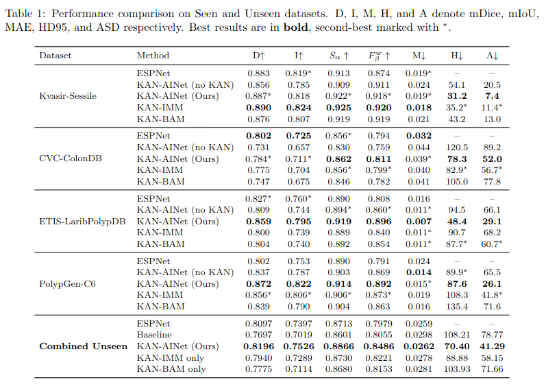

<div align="center">
  
</div>


## KAN-AINet: Kolmogorov-Arnold Network with Adaptive Illumination Modulation for Generalizable Polyp Segmentation


KAN-AINet is a novel polyp segmentation architecture that leverages Kolmogorov-Arnold Networks (KAN) for adaptive illumination modulation and boundary-aware attention. Unlike standard neural networks that use fixed activation functions, KAN learns optimal per-task activation functions, enabling more expressive feature transformations for challenging colonoscopy images.

## 🔥 Highlights

- **State-of-the-Art Performance**  
  Improves mDice by 4.99% and mIoU by 5.07% over prior SOTA on external benchmarks:  
  `Kvasir-Sessile`, `CVC-ColonDB`, `ETIS-LaribPolypDB`, and `PolypGen-C6`.

- **KAN-IMM (Illumination Modulation Module)**  
  Adaptive illumination modulation improves robustness under dark, medium, and bright conditions (largest gain under extreme lighting, p = 0.037).

- **KAN-BAM (Boundary Attention Module)**  
  Utilizes multi-scale edge-aware attention (3×3, 5×5, 7×7 receptive fields) to accurately 
  differentiate true polyp boundaries from illumination artifacts. Reduce HD95 and ASD by 33.7% and 42.95% over the variant without KAN

- **Robust & Consistent Predictions**  
  Brown-Forsythe variance testing confirms significantly lower prediction variance across all 
  illumination conditions (overall ratio: 0.68, p<0.001), demonstrating stable and 
  trustworthy performance across diverse clinical environments.

- **Interpretable Learned Functions**  
  KAN-based activation functions are directly visualizable, providing model interpretability 
  and insight into how the network adapts its feature transformations to polyp segmentation.


## Installation

```bash
# Clone the repository
git clone https://github.com//KAN-AINet.git
cd KAN-AINet

# Create a new conda environment (replace 3.10 with your preferred Python version)
conda create -n kan-ainet python=3.10 -y

# Activate the environment
conda activate kan-ainet

# Install dependencies
pip install -r requirements.txt
```
## Predict an image

To download our KAN-IANet checkpoint, please access via this Huggingface link (will be provided after acceptance).

```bash
from kan_acnet import KANACNet, visualize

kan  = KANACNet("model.pth")          # loads weights, eval mode, auto GPU/CPU
mask = kan("test.jpg")                # numpy uint8 array
visualize("test.jpg", mask)           # displays the result
```
***

## Training

We used the same training dataset as ESPNet. The dataset can be accessed from the official ESPNet GitHub repository:  
[ESPNet Polyp Segmentation Repository](https://github.com/Raneem-MT/ESPNet_Polyp_Segmentation)

You can use the default training configuration or modify the hyperparameters in `config.py`.

### Train KAN-AINet

To train KAN-AINet with the default configuration:

```bash
python train_threshold.py
```

Optional Arguments

```bash
--save_dir ./checkpoints/ablation_with_threshold
# Base directory to save model checkpoints

--log_dir ./logs/ablation_with_threshold
# Base directory for training logs

--output ./ablation_results_with_threshold.json
# Output JSON file to store ablation + threshold tuning results
```

## Model Performance Comparison with ESPNet

<p align="center">
  
</p>

The table above presents a comprehensive comparison between **KAN-AINet** and **ESPNet** across seen and unseen datasets, including segmentation accuracy and boundary-based metrics.

### Example of KAN-AINet Segmentation Performance

<div align="center">
  
</div>

## Inference on Unseen External Validation Dataset

This script evaluates **KAN-AINet** on unseen external validation datasets.

#### Evaluation Metrics

The following metrics are reported: mDice, mIoU, Sα (S-measure), Fβ^w (Weighted F-measure), MAE, HD95, ASD, Precision, Recall, Specificity

The script supports:

- Single checkpoint evaluation
- Full ablation study evaluation
- Per-dataset evaluation
- Combined evaluation
- Automatic JSON result export

---

#### Dataset Structure

Place unseen datasets inside:

```
data_unseen/
 ├── Dataset1/
 │    ├── images/
 │    └── masks/
 ├── Dataset2/
 │    ├── images/
 │    └── masks/
```

Or directly:

```
data_unseen/
 ├── images/
 └── masks/
```

Each dataset must contain:

- `images/` → RGB images
- `masks/` → Binary segmentation masks

---

#### 1. Single Checkpoint Evaluation (Recommended)

Evaluate a single trained model:

```bash
python inference.py \
    --checkpoint path/to/best_model.pth \
    --data_root ./data_unseen \
    --batch_size 8
```
Optional Arguments

```bash
--threshold 0.5          # Override threshold
--output results.json    # Custom output JSON file
```

Results will automatically be saved to:

```
./external_validation_result/
```

---

#### 2. Ablation Study Evaluation (All Configurations)

Evaluate all trained configurations from an ablation study:

```bash
python inference.py \
    --ablation_results path/to/ablation_results.json \
    --checkpoints_dir path/to/checkpoints/ \
    --data_root ./data_unseen
```
Optional Arguments

```bash
--include_baseline   # Include baseline_no_kan (default)
--no_baseline        # Exclude baseline
--batch_size 8
--output results.json
```

The script will:

- Load all configurations from the ablation results file
- Automatically infer encoder and decoder KAN blocks
- Evaluate each configuration
- Print per-dataset results
- Print combined results
- Identify the best configuration (based on mDice)
- Save complete results as JSON

---

#### Output Format

The output JSON file contains:

```json
{
  "data_root": "...",
  "timestamp": "...",
  "configurations": [
    {
      "config_name": "...",
      "encoder_kan_blocks": [...],
      "decoder_kan_blocks": [...],
      "threshold": 0.4,
      "external_validation": {
        "per_dataset": {...},
        "combined": {...}
      }
    }
  ]
}
```

---

#### Notes

- GPU is automatically used if available.
- Threshold is loaded from checkpoint unless manually overridden.
- All folders inside `data_root` that contain `images/` and `masks/` will be evaluated.
- Metrics are computed using `SegmentationMetrics`.
- Both per-dataset and combined results are reported.

